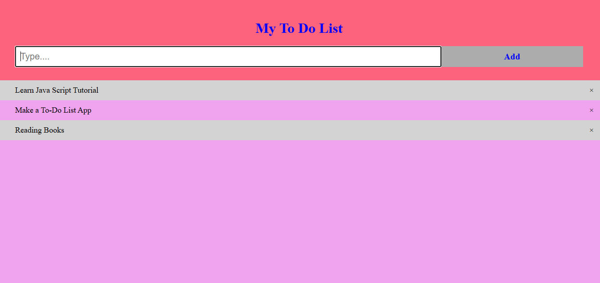
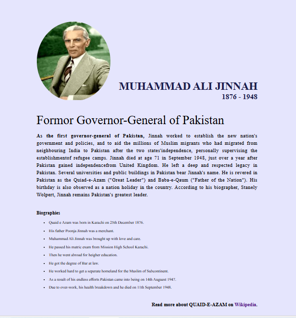

# Task-01

## To-Do List 

A simple and interactive To-Do List app built using HTML, CSS, and JavaScript. This project was developed as part of my internship at CodeSoft.

## Key Features

- **Responsive Design**: Fully responsive design that looks great on all devices.
- **Add Tasks**: Easily add new tasks to the list.
- **Delete Tasks**: Remove tasks from the list.
- **Persistent Data**: Tasks are saved in the browser's local storage so they persist across page reloads.

## Screenshots

## Technologies Used

- **HTML**: For the structure of the app.
- **CSS**: For styling and layout.
- **JavaScript**: For interactivity and functionality.

# Task-02

## Tribute Page

A simple and elegant tribute page built using HTML and CSS. This project was developed as part of my internship at CodeSoft.

## Key Features

- **Responsive Design**: Fully responsive design that looks great on all devices.
- **Clean Layout**: A modern and clean layout to showcase content effectively.
- **Biography Section**: A section dedicated to the biography of the person being honored.
- **Achievements Section**: A section to highlight the major achievements.
- **Gallery Section**: A section with images related to the person or their work.

## Screenshots

## Technologies Used

- **HTML**: For the structure of the tribute page.
- **CSS**: For styling and layout.
